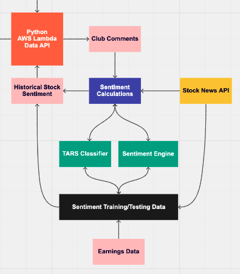

<div align="center">
    <a href="https://www.michiganinvestmentgroup.com/"></a>
</div>

# MIG Platform NLP

[](https://github.com/Michigan-Investment-Group/NLP/actions/workflows/main.yml)

## About the Project

This project is tasked with developing the NLP backend that will power the MIG platform. Specifically, we're hoping to work on using modern NLP algorithms including BERT and TARSClassifier to do earnings call summarization, sentence tagging, and news sentiment analysis. These models will power our frontend endpoints and ultimately help us all make better investing decisions through thorough analysis of future-looking statements and market-moving events.

<div align="center">
    
</div>

## Getting Started

Follow the steps below to get started with the project:

### Using Anaconda

1. Download Anaconda from [here](https://www.anaconda.com/products/individual) if you haven't already

```
2. $ conda env create -f environment.yml
3. $ conda activate mig-platform-nlp
```

### Using Normal Python 3.8 (Not Recommended)

```
1. $ pip3 install -r requirements.txt
```

### Current Tasks

Please check the gitlab for all necessary tasks and user stories that we are currently working on

## Current Milestones

### Earnings Calls

1. Finalize annotations of existing earnings call dataset
2. Implement TARSClassifier using Pytorch Flair
3. Use BERT for Summarization to do Earnings Call Summarization
4. Determine method of calculating a confidence score given specific selection of sentence tags

### News Sentiment

1. Integrate a Stock News API
2. Use BERT / Other methods to do Sentiment Analysis
3. Deploy model

## Resources

### So...NLP?

This section details some resources related to what natural language processing is and how it works. Specifically with recent works done using transformer models.
_Note, it's ok to not understand all of this_

[What is NLP](https://machinelearningmastery.com/natural-language-processing/)

[What is a Transformer](https://medium.com/inside-machine-learning/what-is-a-transformer-d07dd1fbec04)

[Intro to Deep Learning](http://cs231n.stanford.edu/)

[The Illustrated Transformer](http://jalammar.github.io/illustrated-transformer/)

[GPT-3](http://jalammar.github.io/how-gpt3-works-visualizations-animations/)

[CS224N: NLP With Deep Learning](https://online.stanford.edu/artificial-intelligence/free-content?category=All&course=6097)

### Pytorch

Pytorch will be the specific library that we will be using for deep learning and natural language processing. Their [website](https://pytorch.org) has some great resources. Below are some tutorials that were carefully chosen from their website.

[Deep Learning with Pytorch: A 60 Minute Blitz](https://pytorch.org/tutorials/beginner/deep_learning_60min_blitz.html)

[Pytorch Tutorials](https://pytorch.org/tutorials/)

[Seq2Seq Modeling with NN.Transformer](https://pytorch.org/tutorials/beginner/transformer_tutorial.html)

[TorchText](https://pytorch.org/tutorials/beginner/text_sentiment_ngrams_tutorial.html)

### HuggingFace

This is where many of the transformer models have already been implemented. [HuggingFace](https://huggingface.co/transformers/index.html) provides an easily-adjustable API to create and tailor specific models (including BERT, RoBERTA, XLNet, etc.) for various tasks including summarization, tagging, and classification

### Need More Help?

Feel free to reach out to Brandon Fan (@bxfan)
